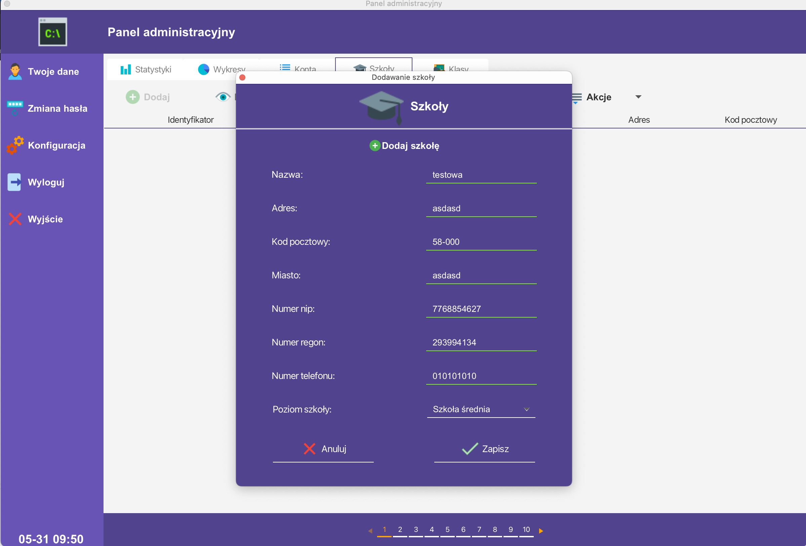

# e-Dziennik

School managment application

**Since 31.05.2023 i decided to temporarily stop developing desktop client**

## Tech Stack

**Client:** JavaFx

**Server:** Spring boot <a href="https://github.com/SaQie/e-Dziennik">(Move to server)</a>

    <h3>Screenshots</h3>

